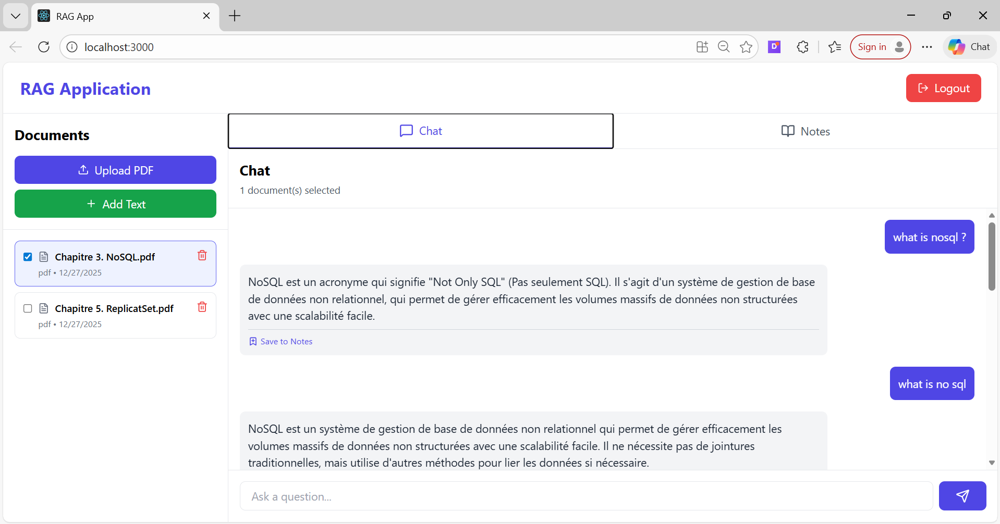
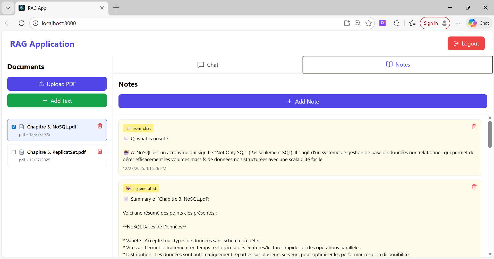
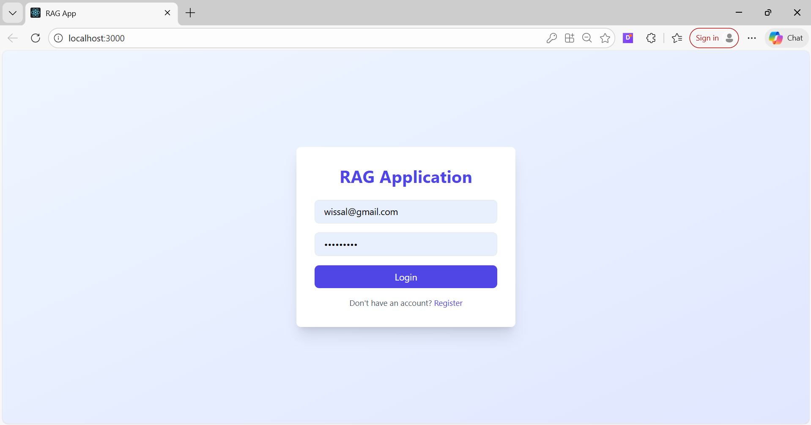
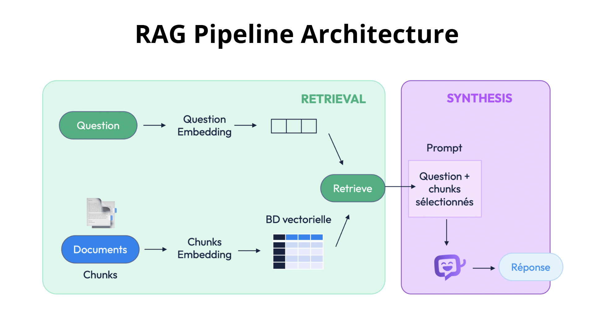

# 📚 Academic RAG Application - NotebookLM Clone

A full-stack Retrieval-Augmented Generation (RAG) application that allows users to upload documents (PDFs and text) and have intelligent conversations with their content using AI. Built with React, FastAPI, and LangChain.


## 🎥 Demo Video


## 📸 Screenshots

### Home Page


### Note Page


### Login Page


### Sign Up Page


## 🎯 Features

- **User Authentication** - Secure JWT-based authentication system
- **Document Management** - Upload PDFs or add text documents
- **Smart Document Selection** - Choose specific documents to query
- **AI-Powered Chat** - Ask questions and get answers grounded in your documents
- **Source Citations** - View which document chunks were used for each answer
- **Notes System** - Save important information and AI-generated summaries
- **Chat History** - All conversations are saved and persisted
- **Per-User Isolation** - Each user's documents and embeddings are completely isolated

## 🔄 RAG Pipeline Flow



## 🛠️ Technology Stack
**Frontend**
- React 18 - UI framework
- Vite - Build tool
- Tailwind CSS - Styling
- Lucide React - Icons

**Backend**
- FastAPI - Web framework
- SQLAlchemy - Database ORM
- Pydantic - Data validation
- Python-JOSE - JWT tokens
- Passlib - Password hashing

**RAG Pipeline**
- LangChain - RAG framework
- ChromaDB - Vector database
- HuggingFace Transformers - Embeddings
- Ollama - Local LLM inference
- PyPDF - PDF text extraction

## 🚀 Quick Start

### Prerequisites

1. **Python 3.9+** - [Download](https://www.python.org/downloads/)
2. **Node.js 18+** - [Download](https://nodejs.org/)
3. **Ollama** - [Download](https://ollama.ai)

### 1. Install Ollama and Model

```bash
# Install Ollama (macOS/Linux)
curl -fsSL https://ollama.ai/install.sh | sh

# Or download for Windows from https://ollama.ai

# Pull the optimized model 
ollama pull phi3:2

# Verify installation
ollama list
```

### 2. Setup Backend

```bash
# Clone the repository
git clone <your-repo-url>
cd rag-app

# Create backend environment
cd backend
python -m venv venv

# Activate virtual environment
# On macOS/Linux:
source venv/bin/activate
# On Windows:
venv\Scripts\activate

# Install dependencies
pip install -r requirements.txt

# Create .env file
cat > .env << EOL
DATABASE_URL=sqlite:///./rag_app.db
SECRET_KEY=$(openssl rand -hex 32)
ALGORITHM=HS256
ACCESS_TOKEN_EXPIRE_MINUTES=10080
OLLAMA_BASE_URL=http://localhost:11434
OLLAMA_MODEL=llama3.2
UPLOAD_DIR=./uploads
CHROMA_DB_DIR=./chroma_db
EOL

# Create necessary directories
mkdir -p uploads chroma_db

# Run the backend
python -m uvicorn app.main:app --reload --host 0.0.0.0 --port 8000
```

Backend should be running at `http://localhost:8000`

### 3. Setup Frontend

```bash
# Open a new terminal
cd frontend

# Install dependencies
npm install

# Run development server
npm run dev
```

### 4. Test the Application

1. Open `http://localhost:3000(by default)` in your browser
2. Register a new account (e.g., `test@example.com` / `password123`)
3. Upload a PDF or add text document
4. Select the document (checkbox)
5. Ask a question in the chat
6. Wait some minutes for response (first query may take longer)

## 📁 Project Structure

```
rag-app/
├── backend/
│   ├── app/
│   │   ├── __init__.py
│   │   ├── main.py              # FastAPI app
│   │   ├── database.py          # SQLAlchemy setup
│   │   ├── models.py            # Database models
│   │   ├── schemas.py           # Pydantic schemas
│   │   ├── auth.py              # JWT authentication
│   │   ├── rag_pipeline.py      # RAG implementation
│   │   └── routers/
│   │       ├── auth.py          # Auth endpoints
│   │       ├── documents.py     # Document endpoints
│   │       ├── notes.py         # Notes endpoints
│   │       └── chat.py          # Chat endpoints
│   ├── uploads/                 # PDF storage
│   ├── chroma_db/               # Vector database
│   ├── requirements.txt
│   └── .env
│
└── frontend/
│   ├── src/
│   │   ├── App.js           # Main React app Entry point
│   │   └── index.js         # Entry point
│   ├── postcss.config.js      # PostCSS configuration
│   └── tailwind.config.js     # Tailwind CSS
│
└── README.md                  # Project documentation
```

## 🔑 Key Implementation Choices

### 1. **Retrieval Strategy**

**Why Semantic Search?**
- Traditional keyword search fails on synonyms (e.g., "AI" vs "artificial intelligence")
- Embeddings capture meaning, not just words
- Works across languages and writing styles

**Our Approach:**
- **Model**: `sentence-transformers/all-MiniLM-L6-v2`
  - Fast
  - Good quality 
  - Pre-trained on 1B+ sentence pairs
- **Chunk Size**: 1000 characters with 200 overlap
  - Captures complete thoughts
  - Overlap ensures context continuity
- **Retrieval**: k=3 chunks (optimized for speed)
  - More chunks = slower but potentially more context
  - 2 chunks provide good balance

### 2. **Generation Strategy**

**Why Ollama + Local LLM?**
- Privacy: Data never leaves your machine
- No API costs
- Full control over model behavior
- Works offline

**Model Choice:**
- **Model**: `llama3.2` (2GB)
  - Higher quality
  - 8-15 second responses
  - Better for complex questions

**Optimizations:**
- Temperature: 0.7 (focused, less random)
- Context window: 2048 tokens (faster processing)
- Max output: 512 tokens (concise answers)
- Async processing (non-blocking)

### 3. **Multi-User Isolation**

**Challenge**: How to prevent users from accessing each other's data?

**Solutions Implemented:**
1. **Database Level**: Foreign keys + JWT verification
   ```python
   # Every query checks ownership
   document = db.query(Document).filter(
       Document.id == document_id,
       Document.user_id == current_user.id  # ← Ensures isolation
   ).first()
   ```

2. **Vector DB Level**: Separate collections per user
   ```python
   collection_name = f"user_{user_id}_documents"
   # Each user has their own ChromaDB collection
   ```

3. **File System Level**: User directories
   ```
   uploads/
   ├── user_1/
   │   └── document.pdf
   └── user_2/
       └── document.pdf
   ```

### 4. **Performance Optimizations**

**Problem**: First queries were taking 30+ seconds

**Solutions Applied:**
1. Reduced chunk size (1000 → 500 chars): 2x faster embedding
2. Fewer retrieved chunks (4 → 2): 1.5x faster search
3. Smaller context window (2048 → 1024): 1.5x faster generation
4. Async processing: Non-blocking I/O
5. Faster model (phi3:mini): 3-5x faster than llama3.1:8b

**Result**: 30s → 3-8s response time (5-10x improvement)

## 🔧 Troubleshooting

### Slow Responses (>15 seconds)

```bash
# 1. Use faster model
ollama pull phi3:mini

# 2. Check GPU usage
nvidia-smi  # Should show Ollama process

# 3. Monitor system resources
top  # Check CPU/RAM usage
```

### "Connection Refused" Error

```bash
# Ensure Ollama is running
ollama serve

# Test connection
curl http://localhost:11434/api/tags
```

### "No relevant information found"

- Ensure documents are uploaded successfully
- Check selected documents (checkboxes)
- Verify backend logs for embedding errors
- Try asking more specific questions


## 🙏 Acknowledgments

- **LangChain** - RAG framework
- **Ollama** - Local LLM inference
- **ChromaDB** - Vector database
- **FastAPI** - Modern Python web framework
- **React** - UI library
- **HuggingFace** - Embedding models

## 🔗 Links


- [Video Presentation](https://youtu.be/YOUR_VIDEO_LINK)
- [Architecture Diagram](./screenshots/architecture-diagram.png)
- 

---
